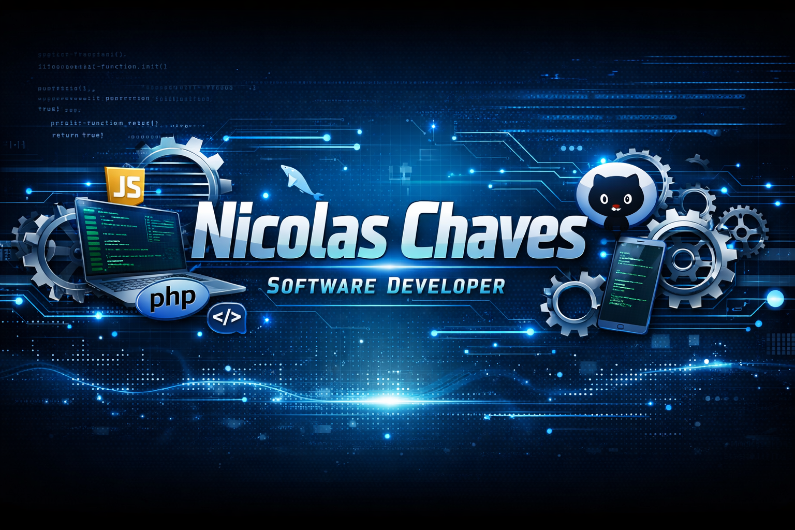

  

  

---

## 👨‍💻 Sobre mim

Olá! Meu nome é **Nicolas Dos Santos Chaves**.

Sou estudante de **Engenharia de Software (2025 - 2028)** e apaixonado por tecnologia, desenvolvimento de sistemas e criação de soluções digitais.

Gosto de desenvolver **projetos próprios**, explorar novas tecnologias e construir aplicações que resolvam **problemas reais**.

Atualmente estou focado em evoluir minhas habilidades em:

* Desenvolvimento Web
* Backend
* Sistemas completos

---

## 🎓 Formação

📚 **Engenharia de Software**
2025 — 2028

Foco em:

* Estrutura de dados
* Arquitetura de softwares
* Engenharia de sistemas
* Desenvolvimento full stack
* Desenvolvimento web

---

## 🚀 Tecnologias

---

## 📌 Projetos em Destaque

<table>

<tr>

<td align="center" width="400">

### 🍔 Sistema de pedidos para pastelaria

Aplicação web com carrinho de compras e backend em PHP.

</td>
<td align="center" width="400">

### 📘 GNSystem - Diário de APS

Repositório com registros e materiais das aulas de Análise e Projetos de Sistemas.

<a href="https://github.com/NicolasChaves07/GNSystem">
<svg xmlns="http://www.w3.org/2000/svg" width="16" height="16" fill="currentColor" class="bi bi-box-arrow-up-right" viewBox="0 0 16 16">
  <path fill-rule="evenodd" d="M8.636 3.5a.5.5 0 0 0-.5-.5H1.5A1.5 1.5 0 0 0 0 4.5v10A1.5 1.5 0 0 0 1.5 16h10a1.5 1.5 0 0 0 1.5-1.5V7.864a.5.5 0 0 0-1 0V14.5a.5.5 0 0 1-.5.5h-10a.5.5 0 0 1-.5-.5v-10a.5.5 0 0 1 .5-.5h6.636a.5.5 0 0 0 .5-.5"/>
  <path fill-rule="evenodd" d="M16 .5a.5.5 0 0 0-.5-.5h-5a.5.5 0 0 0 0 1h3.793L6.146 9.146a.5.5 0 1 0 .708.708L15 1.707V5.5a.5.5 0 0 0 1 0z"/>
</svg>
</a>

</td>

</tr>

</table>

 

🔹 **Sistema de autenticação de usuários**
Sistema completo de login com sessões e verificação de credenciais.

---

## 🏆 Conquistas do GitHub

---

## 📊 Estatísticas do GitHub

  

---

## 📊 Gráfico de atividade

---

## 🐍 Contribuições (snake animation)

---

## 📫 Contato

📧 **Email:**
[nicolaseregina@gmail.com](mailto:nicolaseregina@gmail.com)

💻 **GitHub:**
https://github.com/NicolasChaves07

---

⭐ Obrigado por visitar meu perfil!

